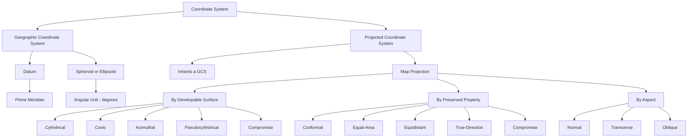

# 🌍 The 3D → 2D Dish — Master Plan
### An open-source "kitchen" for understanding and choosing map projections

You're right that the coordinate-system tree is genuinely one of the hardest things in GIS to hold in your head — the hierarchy tree image and your Lecture-11 notes on cylindrical/conic/azimuthal projections both show *why*: there are three independent axes of classification (surface, property, aspect) tangled together, and most tutorials only show you one at a time. This plan turns that tangle into a browsable, cookable system, and ends with a ready-to-paste brief for Antigravity to start building Phase 1.

---

## TL;DR

Build a small, open-source web app where map projections are organized like a stocked kitchen:

- **Pantry** — every major projection, tagged by family, preserved property, and aspect
- **Recipe** — a short wizard that turns "what am I mapping, and what matters most" into a ranked projection recommendation
- **Plating** — a 3D globe that visibly unwraps into the chosen 2D projection, with distortion made visible (Tissot's indicatrix)
- **Open kitchen** — anyone can add a new ingredient (projection) or recipe (use case) via GitHub

Two files come out of this plan: this document, and `projections-catalog.json` — a structured seed dataset of 24 projections your coding agent can drop straight into the app.

---

## 1. The problem this solves

Almost every intro-GIS explanation of projections shows one diagram (surface families) or one list (properties) but not how they interlock — which is exactly the gap between your hierarchy-tree image and your handwritten notes. The result: most people, including working mapmakers, default to whatever projection their software opens with (usually Web Mercator) rather than the one that's actually right for the job. A "kitchen" that lets someone say *"I'm mapping ice extent near the poles and area matters most"* and get back *"Lambert Azimuthal Equal-Area, polar aspect — here's why, here's what it looks like"* solves that in one interaction.

## 2. The core metaphor → the product

| Kitchen concept | Software concept |
|---|---|
| Pantry | Structured projection catalog (`projections-catalog.json`) |
| Ingredient tags | Family / preserved property / aspect metadata on each projection |
| Recipe | A rule that maps "mapping goal + priority + region" → ranked projections |
| Cooking / plating | The globe-to-flat unwrap animation + rendered output map |
| The kitchen | The web app itself |
| Cookbook | Per-projection research notes (history, math reference, real-world use) |
| Open kitchen | Public GitHub repo — new ingredients and recipes are pull requests |

## 3. One correction worth making before we stock the shelf

Your notes (page 3) list UTM under the "Equal Area" property, next to the Lambert Cylindrical Equal-Area example. Worth fixing before it goes into a public teaching tool: **UTM is a Transverse Mercator variant, and Transverse Mercator is *conformal*, not equal-area** — it inherits Mercator's angle-preserving property, just rotated so the tangent line runs along a meridian instead of the equator. That's *why* it's the standard for topographic and engineering work: local shape and angle accuracy matter more than area for site-scale surveying. Lambert Cylindrical Equal-Area (and its Gall–Peters variant) is the actual equal-area cylindrical example. I've tagged this correctly in the catalog file.

## 4. Foundation layer — where projections sit inside GIS coordinate systems

Your hierarchy-tree image already has this right; it's the prep station before any cooking starts. A Projected Coordinate System (PCS) is always a Geographic Coordinate System (GCS) *plus* a projection — you can't project without first fixing a datum, ellipsoid, and prime meridian.



(This renders natively as a diagram once the file is on GitHub — no image needed.)

## 5. The five shelves — developable-surface families

- **Cylindrical** — sphere projected onto a cylinder tangent or secant to a great circle (usually the equator, or a meridian in transverse aspect). Straight, perpendicular graticule in normal aspect. Best for navigation and narrow N–S strips.
- **Conic** — a cone over the globe, tangent (one standard parallel) or secant (two). Best for mid-latitude regions with east–west extent — the US, Europe, a belt of the Himalaya.
- **Azimuthal (planar)** — a flat plane touching the globe at one point. Only that point is distortion-free in every direction; direction *from* that point is always true. Best for polar regions and single-city "distance from here" maps.
- **Pseudocylindrical** — parallels stay straight like cylindrical, but meridians curve toward the poles. Almost always used for equal-area whole-world thematic maps.
- **Compromise** — not derived from a literal developable surface; balances several distortions instead of perfecting one. Best for general-reference world maps meant to just *look* right.

## 6. Properties — the flavor profile that cuts across every shelf

No projection can preserve everything; each one picks what to protect.

| Property | Preserves | Distorts |
|---|---|---|
| Conformal | Local angles and shapes | Area (often severely near poles/edges) |
| Equal-Area (Equivalent) | Area / size ratios | Shape and angle |
| Equidistant | True distance from one point, or along specific lines | Everything else, away from those lines |
| True-Direction (Azimuthal) | True compass bearing from one center point | Distance and shape away from center |
| Compromise (Aphylactic) | A pleasant overall balance | A little of everything, on purpose |

## 7. The catalog

`projections-catalog.json` (companion file) holds 24 projections across the five families above, each tagged with property, typical aspect, year/author where known, best-fit use cases, and a plain-language distortion note. Sample entries:

| Name | Family | Property | Classic use |
|---|---|---|---|
| Mercator | Cylindrical | Conformal | Marine navigation, web slippy maps |
| UTM | Cylindrical (transverse) | Conformal | Topographic / engineering surveys |
| Albers Equal-Area Conic | Conic | Equal-area | US/national thematic & census maps |
| Lambert Conformal Conic | Conic | Conformal | Aeronautical charts, mid-lat countries |
| Polar Stereographic | Azimuthal | Conformal | Arctic/Antarctic ice & cryosphere data |
| Azimuthal Equidistant | Azimuthal | Equidistant + true direction | Distance-from-a-point maps (UN emblem) |
| Goode Homolosine | Pseudocylindrical | Equal-area | Interrupted "orange-peel" world maps |
| Winkel Tripel | Compromise | Balanced | National Geographic's world map since 1998 |

World boundary data should come from **Natural Earth** (public domain, no attribution required — ideal for an open-source repo) as TopoJSON.

## 8. The recipe engine — how the app recommends a projection

A short wizard, four questions, deterministic scoring (no ML needed — this should stay explainable):

1. **What are you mapping?** Whole world / continent / country / small region
2. **What matters most?** True area · true shape & angle · true distance from a point · true direction from a point · a balanced general look
3. **Where is it?** Equatorial / mid-latitude / polar
4. **What's it for?** Navigation · thematic statistics · topographic base map · web map · print atlas

| Priority | Best family | Example output |
|---|---|---|
| True area | Equal-area (any surface) | Albers, Lambert Azimuthal EA, Goode Homolosine |
| True shape/angle | Conformal | Mercator, UTM, Lambert Conformal Conic, Stereographic |
| True distance from a point | Equidistant | Azimuthal Equidistant, Equidistant Conic |
| True direction from a point | Azimuthal | Azimuthal Equidistant, Gnomonic |
| Balanced world reference | Compromise | Winkel Tripel, Natural Earth, Robinson |
| Polar (ice, cryosphere) | Azimuthal, polar aspect | Polar Stereographic, Lambert Azimuthal EA |
| Mid-latitude, E–W extent | Conic | Lambert Conformal Conic, Albers |
| Narrow N–S strip | Transverse cylindrical | Transverse Mercator, UTM |

## 9. Visualization plan — plating the dish

- **Globe → flat unwrap animation** (the centerpiece): start on a rotatable 3D orthographic-style globe, animate the "unwrapping" into the chosen 2D projection.
- **Tissot's indicatrix toggle** — small distortion circles overlaid on the map, the standard way to *show* rather than tell distortion.
- **Compare mode** — two projections side by side, or ghosted over each other.
- **The shelf UI** — a filterable card grid (family / property / aspect), search by name.
- Carry your established cartographic conventions into the UI: graticule labels sit outside the neatline, titles live in captions rather than burned into the rendered map, scale bars are clean and purpose-built rather than a default library widget. Keeps the tool's output consistent with the maps you already make.

## 10. Tech stack & architecture

**Primary: a static web app**, because the goal is "for everyone" — a shareable browser link beats a notebook for reach.

- **D3.js** (`d3-geo` + `d3-geo-projection`) — covers most of the 24 catalog projections out of the box
- **Three.js** — the 3D globe and the unwrap animation
- **Proj4js** — on-the-fly reprojection for anything D3 doesn't ship natively
- **Natural Earth TopoJSON** — world boundaries, public domain
- **Vite + TypeScript**, deployed free on **GitHub Pages**

```text
3d-to-2d-dish/
├── README.md
├── 3D-to-2D-Dish-Master-Plan.md
├── data/
│   ├── projections-catalog.json
│   ├── recipe-rules.json
│   └── world-110m.json
├── src/
│   ├── main.ts
│   ├── globe/          # Three.js globe + unwrap animation
│   ├── projections/    # d3-geo-projection + proj4 wrappers
│   ├── shelf/          # the pantry browser UI
│   ├── recipe/         # the decision wizard
│   └── compare/        # side-by-side / overlay mode
├── public/
├── tests/
├── docs/
│   └── CONTRIBUTING.md
├── package.json
└── vite.config.ts
```

**Optional Phase 0 shortcut**: given you already have a fast geopandas/matplotlib/Cartopy workflow, a quick Streamlit or Colab prototype could validate the catalog and recipe logic in a day or two, before investing in the full JS build. Not required — just a fast way to pressure-test the recipe rules with real data before Antigravity scaffolds the real thing.

## 11. Content & research workstream

For an open-source project other people can trust and contribute to, each catalog entry should eventually carry: history (year, author), the standard reference formula, EPSG code where one genuinely applies (many, like Albers or Lambert Conformal Conic, are parameterized per study area rather than having one universal code — don't force a fake one), a plain-language distortion description, and one real-world example of who uses it. **Snyder (1987), *Map Projections: A Working Manual* (USGS)** is the standard academic reference to cite throughout — it's the source most GIS textbooks (including the Bolstad chapter you're studying from) ultimately draw from. A `docs/CONTRIBUTING.md` with that template turns "add a projection" into a well-defined, reviewable pull request.

## 12. Roadmap

| Phase | Deliverable |
|---|---|
| 0 | Finalize catalog + recipe rules (this plan + the JSON file cover this) |
| 1 | MVP: shelf browser + static 2D projection preview (no 3D yet) |
| 2 | Recipe wizard wired to the scoring table |
| 3 | 3D globe unwrap animation |
| 4 | Compare mode + Tissot's indicatrix |
| 5 | Polish, accessibility pass, GitHub Pages deploy, CONTRIBUTING.md |

## 13. Assumptions I made — flag anything you want changed

- Web app (not a Python/desktop tool) as the primary deliverable, for reach
- Static site, no backend, for v1 — keeps GitHub Pages hosting free and simple
- Catalog scope: 24 well-established projections, not an exhaustive 500+ list — deep enough to be genuinely useful, shallow enough to actually finish
- Recipe engine is rule-based and explainable, not ML-based — appropriate for a teaching tool where *why* matters as much as *what*

---

## 14. 🚀 The prompt to hand Antigravity

Antigravity works best from a task-oriented brief rather than line-by-line instructions — it plans its own implementation and can verify the result in its built-in browser. Paste this as the first task:

```
Project: "3D to 2D Dish" — an open-source map-projection explorer and picker.

Read 3D-to-2D-Dish-Master-Plan.md and projections-catalog.json in this repo
first — they are the source of truth for scope, taxonomy, and content.

Build Phase 1 only (see the Roadmap section of the master plan):
a static web app (Vite + TypeScript) with:
1. A "shelf" screen that lists all projections from projections-catalog.json
   as filterable cards, grouped by family (cylindrical / conic / azimuthal /
   pseudocylindrical / compromise), filterable by preserved property
   (conformal / equal-area / equidistant / true-direction / compromise).
2. Clicking a card shows a static 2D world map rendered in that projection
   using d3-geo / d3-geo-projection, over Natural Earth TopoJSON boundaries,
   plus the catalog entry's metadata (year, author, best-for, distortion note).
3. Clean typography, no build errors, deployable as a static site.

Do not build the 3D globe animation, the recipe wizard, or compare mode yet
— those are Phases 2 to 4 and should be separate follow-up tasks once
Phase 1 is verified working in the browser.

Follow the repo structure in the master plan's Tech Stack section.
```

Run phases 2–4 as separate, later tasks once you've checked Phase 1 actually works — that keeps each Antigravity run scoped to something it can verify end-to-end in its own browser, rather than one giant ask.

---

Good luck with it — this is a genuinely useful thing to open-source, and the "everyone should be able to pick the right projection" instinct is a real gap in the GIS tooling world right now.
